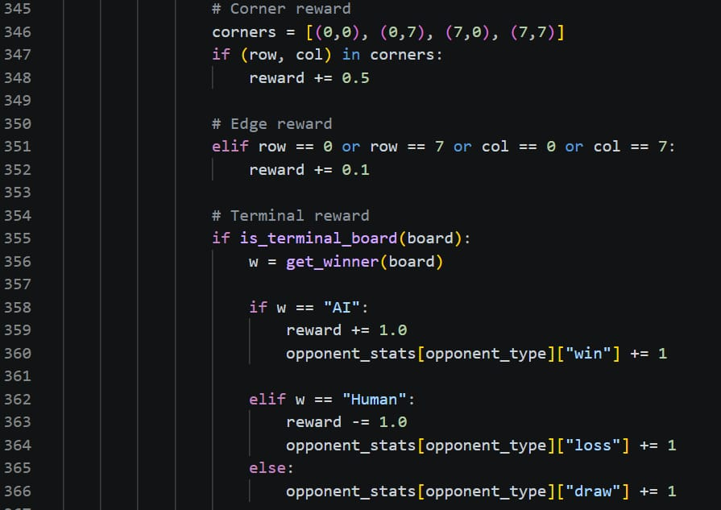
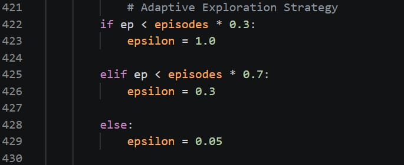
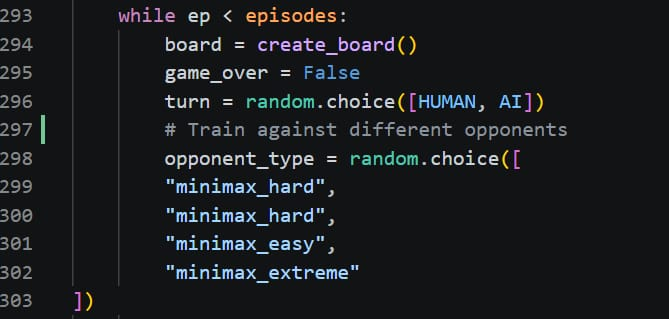
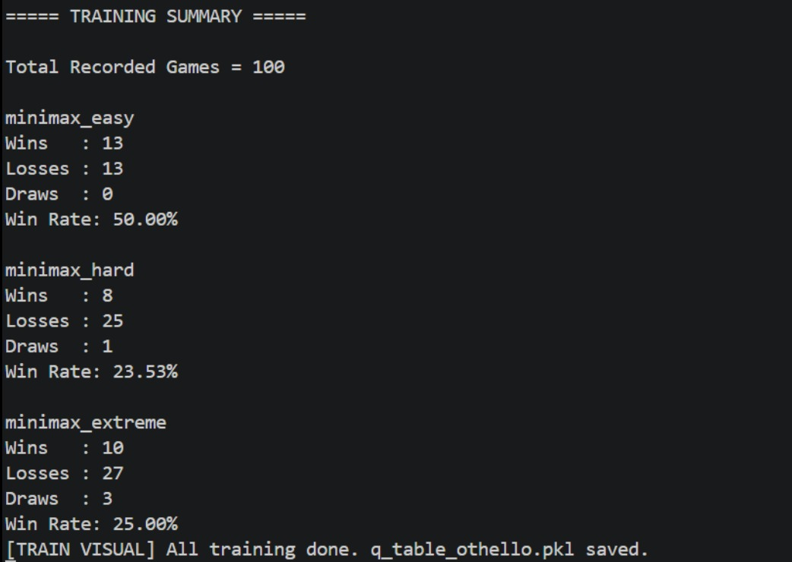
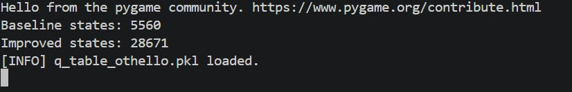
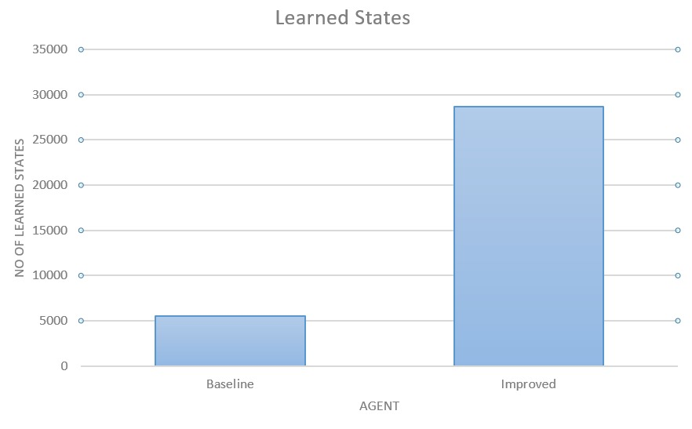
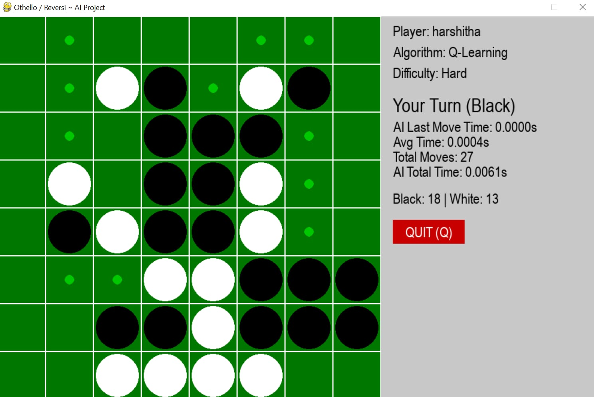
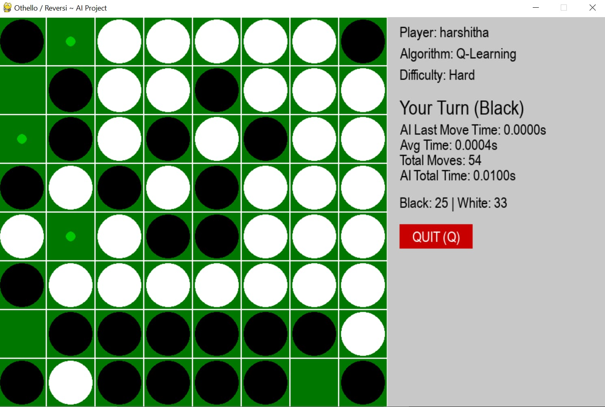
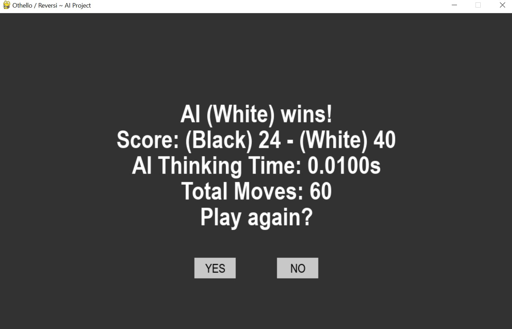

# Othello / Reversi: AI Algorithms Project

This repository contains an AI-powered version of the classic Othello/Reversi game. Various algorithms such as Minimax (with Alpha-Beta Pruning), A*, Monte Carlo Tree Search (MCTS), Q-Learning, Negamax, Advanced Heuristic Search, Iterative Deepening, and Move Ordering have been implemented. Users can choose both algorithm and difficulty level (Easy, Medium, Hard, Extreme), allowing for enhanced strategic depth and dynamic gameplay.

The detailed report (see summary below) covers the mathematical foundations, implementation strategies, Q-Learning training procedure, and pros/cons of each algorithm, supported by visuals.

---

## Table of Contents

- [Overview](#overview)
- [Algorithms](#algorithms)
- [Difficulty Levels](#difficulty-levels)
- [Screenshots](#screenshots)
- [Installation & Usage](#installation--usage)
- [Code Structure](#code-structure)
- [Results & Evaluation](#results--evaluation)
- [Reinforcement Learning Improvements](#reinforcement-learning-improvements)
- [References](#references)

---

## Overview

Othello is a strategic 8x8 board game where two players (Black and White) try to outmaneuver each other by flipping the opponent’s pieces. The primary goal of this project is to simulate intelligent gameplay using different AI algorithms and analyze their performance in terms of execution time, strategic quality, and learning ability.

Key Features:
- Multiple AI algorithms (Minimax, A*, MCTS, etc.)
- Visual and interactive Q-Learning training
- Adjustable difficulty settings with controlled randomness
- Logging game stats to CSV
- "Play Again?" option at game end
- Move animations and legal move highlights

---

## Algorithms

(Algorithms section remains unchanged — see your previous content)

---

## Difficulty Levels

(Randomness explained — unchanged from previous content)

---

## 📷 Screenshots

Below are screenshots from various parts of the project interface:

### 🎮 Game Screens

- **In-Game Board View**  
    
  Displays the game board with black/white pieces, current player information, legal move highlights, and status panel.

- **Alternate In-Game View**  
    
  A second perspective on the game board emphasizing visual elements like highlighted moves and player stats.

### ⚙️ Interface Elements

- **Algorithm Selection Screen**  
    
  User selects the desired AI algorithm (Minimax, A*, MCTS, etc.).

- **Difficulty Selection Screen**  
    
  User chooses between Easy, Medium, Hard, and Extreme difficulty levels.

### 🧠 Q-Learning Training

- **Episode Count Input Screen**  
    
  Interface to input how many episodes the agent should train against the Minimax opponent.

- **Q-Learning Training Interface**  
    
  Shows Q-Learning agent in training mode, playing against a Minimax opponent.

- **Q-Table Sample**  
    
  Displays a snapshot of state-action Q-values learned by the agent.

- **Q-Table Plot**  
    
  Visual representation of the learned Q-values over training.

### 🏁 Game Over Screens

- **AI Victory Screen**  
    
  Shows endgame statistics when AI wins.

- **Player Victory / Tie Screen**  
    
  Shows final result when the player wins or a tie occurs.

### 📊 Performance Evaluation

- **AI Win Rate by Algorithm**  
    
  Displays win percentages for each algorithm.

- **Thinking Time vs. Win Rate**  
    
  Comparison between average AI thinking time and win rate.

- **Average Game Duration**  
    
  Illustrates average duration per game per algorithm.

- **Games Played and AI Wins**  
    
  Total number of games played and AI win counts by algorithm.

---

## Reinforcement Learning Improvements

As part of the project enhancement, the original Q-Learning implementation was improved using three reinforcement learning strategies.

### Improvement 1: Reward Shaping

The reward function was modified to encourage strategically strong moves.

* Corner positions: +0.5 reward
* Edge positions: +0.1 reward
* Win reward: +1.0
* Loss penalty: -1.0

This helps the agent prioritize stable board positions and improve long-term gameplay performance.

### Improvement 2: Adaptive Exploration Strategy

Instead of using a fixed exploration rate, epsilon is adjusted during training:

| Training Phase | Epsilon |
| -------------- | ------- |
| Early Training | 1.0     |
| Mid Training   | 0.3     |
| Late Training  | 0.05    |

This allows extensive exploration initially and greater exploitation of learned knowledge in later stages.

### Improvement 3: Multi-Opponent Training

The Q-Learning agent was trained against multiple Minimax opponents of varying strengths:

* Minimax Easy (depth 1)
* Minimax Hard (depth 2)
* Minimax Extreme (depth 3)

Training against multiple opponents improves robustness and generalization.

### Training Outcome

| Metric         | Baseline | Improved |
| -------------- | -------- | -------- |
| Learned States | 5,560    | 28,671   |

The improved agent explored a significantly larger portion of the state space during training.

Additional implementation screenshots and evaluation results are available in the `results/` folder.

### Improvement Screenshots

#### Reward Shaping

#### Adaptive Exploration

#### Multi-Opponent Training

#### Training Summary

#### State Space Growth

#### Learned States Comparison

#### Q-Learning Performance

#### Q-Table Growth

#### Mid-Game Example 1

#### Mid-Game Example 2

#### Final Game Result

## Installation & Usage

(Unchanged from your original, but you can optionally adjust "Private" under `git clone` if this is public.)

---

## Results & Evaluation

(Unchanged from your original — contains insightful breakdown of each method’s performance.)

---

## References

(Unchanged)

---

Feel free to open an issue or pull request for questions, bugs, or contributions.

Thanks for visiting!
